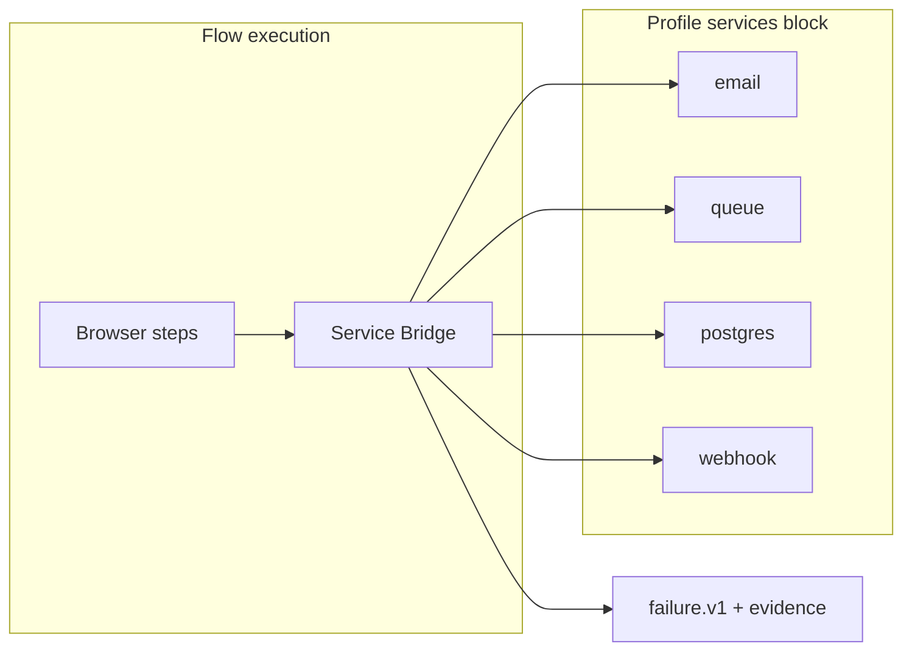

# GhostRun 2.0-alpha — Service Bridge + Per-Repo Scope

**Status:** Plan (post 2.0.0-alpha.1)  
**Target:** `2.0.0-alpha.2` — ship both tracks before 2.0-beta  
**Principle:** Flows and profiles live **in the repo**; third-party async work becomes **first-class flow steps**, not tribal wiki knowledge.

---

## Part 1 — Why teams get stuck (the real problem)

Browser automation breaks on the **happy path UI**. Teams abandon QA automation on the **everything-after-click** path:

| Stuck moment | What they need | Today in GhostRun |
|--------------|----------------|-------------------|
| "Check your email for the magic link" | Read inbox, extract URL, continue flow | ✗ manual |
| "Password reset sent" | Same | ✗ |
| "Webhook fired → job queued → row in PG" | Wait for job + assert DB | ✗ |
| "Stripe checkout completed" | Poll API or test webhook | ✗ |
| "SMS OTP" | Test inbox / Twilio test creds | ✗ |
| "Feature flag / seed user in PG" | Fixture SQL before run | △ manual scripts |

Playwright/Cypress: **click the button**.  
Checkly: **poll production URL**.  
GhostRun opportunity: **complete the async story** — with evidence in the same report.

---

## Part 2 — Service Bridge (product concept)

### Name: **GhostRun Service Bridge**

Optional profile-attached connectors that flow steps can use. **Local-first, BYO infrastructure** — Mailpit on laptop, staging PG read replica, Redis in docker-compose. No GhostRun-hosted email.

### Architecture



### Profile schema (new)

```json
{
  "name": "staging",
  "baseUrl": "https://staging.app.com",
  "services": {
    "email": {
      "provider": "mailpit",
      "apiUrl": "http://localhost:8025",
      "inbox": "catch-all",
      "timeoutMs": 30000
    },
    "postgres": {
      "connectionSecret": "STAGING_DATABASE_URL",
      "readOnly": true,
      "fixtures": [".ghostrun/fixtures/sql/base-seed.sql"]
    },
    "queue": {
      "provider": "redis",
      "urlSecret": "REDIS_URL",
      "queues": ["default", "mailers"]
    },
    "webhook": {
      "captureUrl": "http://localhost:8787/hooks",
      "secretRef": "WEBHOOK_SIGNING_SECRET"
    }
  }
}
```

Secrets stay in env / `.ghostrun/auth/secrets/` — never in git.

### New flow actions (phased)

| Action | Phase | Behavior |
|--------|-------|----------|
| `email:wait` | **α.2** | Poll Mailpit/Mailhog API for message matching to/subject; fail with inbox snapshot in report |
| `email:extract-link` | **α.2** | Parse href from last matched email → store in `{{magicLink}}` |
| `email:click-link` | **α.2** | Navigate browser to extracted link |
| `services:seed` | **α.2** | Run profile SQL fixtures (transaction, rollback in CI optional) |
| `db:assert` | **β** | Read-only SQL; assert row count or value |
| `queue:wait` | **β** | Poll Redis list / Bull job until empty or job id complete |
| `webhook:wait` | **β** | Block until capture relay receives POST matching path |
| `webhook:replay` | **β** | POST captured payload to app URL |

### CLI (zero-memorization fit)

All reachable from `ghostrun` home menu → **Services**:

```bash
ghostrun services list          # show profile service config
ghostrun services doctor        # reachability: mailpit, redis, pg
ghostrun services inbox         # last 5 captured emails (debug)
ghostrun services seed          # apply fixtures for active profile
```

Interactive home adds:
- **"Services not reachable"** warning in setup funnel when profile declares email/queue but doctor fails
- **"Complete signup flow"** author template: record UI → auto-insert `email:wait` step

### Evidence (world-class)

When `email:wait` fails, report includes:
- Expected to/subject
- Last 3 messages in inbox (sanitized)
- Screenshot of still-visible "check your email" UI
- Suggested fix: "Start Mailpit: `docker compose -f .ghostrun/services/dev.yml up`"

Same pattern for queue timeout (last job ids, queue depth).

### Docker template (shipped in npm)

`.ghostrun/services/dev.compose.yml` (copy on init):

```yaml
services:
  mailpit:
    image: axllent/mailpit
    ports: ["8025:8025", "1025:1025"]
  redis:
    image: redis:7-alpine
    ports: ["6379:6379"]
  postgres:
    image: postgres:16-alpine
    environment:
      POSTGRES_PASSWORD: ghostrun
    ports: ["5432:5432"]
```

`ghostrun services up` → optional wrapper to start project fixtures.

### Differentiation (one line)

**GhostRun waits for your email, queue, and database — not just the button.**

No competitor ships this **inside the same flow + profile + evidence bundle** for local and CI.

### Out of scope (stay disciplined)

- GhostRun does not host email/queues
- Not a replacement for Datadog/New Relic
- Not full Stripe/Salesforce test harness in α.2 (later integrations)

---

## Part 3 — Per-repo scope (fix the gaps now)

### Current gap (honest)

| Asset | Documented location | Actual location |
|-------|--------------------|-----------------|
| config, profiles | `.ghostrun/` ✓ | `.ghostrun/` ✓ |
| flows | `.ghostrun/flows/` | **`~/.ghostrun/data/ghostrun.db`** (global) |
| runs, evidence | `.ghostrun/runs/` | `.ghostrun/runs/` ✓ (v1.3+) |
| suites, schedules | project | global DB |

**Symptom:** Two repos → one shared flow list. CI on repo A can see flows from repo B.

### Target model: **Project-first storage**

```text
.ghostrun/
  project.json          # id, name, createdAt
  config.json
  data/
    ghostrun.db         # SQLite scoped to THIS repo only
  flows/
    browser/*.flow.json # git-committable source of truth (export format)
    api/
  profiles/
  runs/                 # gitignored
  fixtures/
    sql/
    services/
```

**Global `~/.ghostrun/`** retains only:
- Machine cache (optional)
- Global AI usage rollup (optional)
- Playwright browser paths

### Resolution rules

1. **Find project root:** walk up from `cwd` until `.ghostrun/config.json` exists
2. **Open DB:** `.ghostrun/data/ghostrun.db` (create on init)
3. **If no project:** `ghostrun` home offers init (already in α.1)
4. **MCP server:** accept `GHOSTRUN_PROJECT_ROOT` or detect from cwd

### Flow sync strategy (file + DB)

**Write path:** create/update flow → write `.flow.json` **and** upsert DB row  
**Read path:** list flows from DB (fast); import on startup scans `flows/**/*.flow.json`  
**Git story:** team commits `flows/browser/login.flow.json`; clone → `ghostrun sync flows` or auto on init

```bash
ghostrun sync flows      # import *.flow.json → DB
ghostrun sync export     # export DB → *.flow.json (backup)
```

### Migration (one-time)

```bash
cd your-repo
ghostrun migrate project-scope
```

- Creates `.ghostrun/data/ghostrun.db`
- Offers to import flows from global DB (by name/tag or all)
- Sets `project.json` with stable `projectId`
- Does **not** delete global DB (safe rollback)

### Code changes (implementation map)

| File / area | Change |
|-------------|--------|
| `packages/database/src/manager.ts` | Accept `dbPath` constructor arg; default project path |
| `ghostrun.ts` | `resolveProjectRoot()`, pass path to `DatabaseManager` |
| `mcp-server.ts` | Project-aware DB path |
| `ensureProjectWorkspace()` | create `data/`, `fixtures/sql/`, `services/` |
| `createFlow` / `updateFlow` | dual-write `.flow.json` |
| `runInit` / home funnel | call `syncFlowsFromDisk()` |
| Tests | temp dir per test already; assert DB isolation |

### `.gitignore` template update

```gitignore
runs/
reports/
auth/secrets/
auth/storage-state/
data/ghostrun.db
*.local.json
```

Commit: `flows/`, `profiles/`, `config.json`, `fixtures/`, `services/dev.compose.yml`

---

## Part 4 — Release plan (2.0.0-alpha.2)

Ship both tracks in one alpha — they reinforce each other (per-repo profiles **with** service blocks).

### Sprint A — Project scope (5–7 days)

| # | Task | Done when |
|---|------|-----------|
| A1 | `resolveProjectRoot()` + project DB path | flows in repo A ≠ repo B |
| A2 | Dual-write flows to `.flow.json` | export matches DB |
| A3 | `ghostrun sync flows` | fresh clone imports flows |
| A4 | `ghostrun migrate project-scope` | docs + test |
| A5 | MCP + doctor use project path | MCP lists correct flows |
| A6 | Update home menu: show project name + path | status note |

### Sprint B — Service Bridge MVP (5–7 days)

| # | Task | Done when |
|---|------|-----------|
| B1 | Profile `services` schema + validation | config example |
| B2 | Mailpit client + `email:wait` / `extract-link` | signup E2E demo works |
| B3 | `ghostrun services doctor` | clear pass/fail |
| B4 | Executor steps in `executeFlow` | variables flow to next step |
| B5 | Failure evidence for email timeout | report panel |
| B6 | `services/dev.compose.yml` template | init copies file |
| B7 | Home → Services submenu | zero memorization |

### Sprint C — Polish (2–3 days)

- Author template: "Signup with email verification"
- CHANGELOG 2.0.0-alpha.2
- getting-started.md section: Service Bridge
- One e2e test with Mailpit (docker or mock)

### Deferred to 2.0-beta

- `db:assert`, `queue:wait`, Linear dedup (already planned)
- Stripe webhook helper
- App Memory Graph

---

## Part 5 — Success criteria

| Metric | Target |
|--------|----------|
| Two repos, two flow lists | 100% isolated |
| Fresh clone → run smoke | `git clone && ghostrun && run` in < 5 min |
| Signup + email link flow | Works with local Mailpit, no manual inbox |
| Service doctor | Fails with actionable fix command |
| Report on email timeout | Shows inbox snapshot in evidence |

---

## Part 6 — Recommended build order

```
Week 1:  A1 → A2 → A3  (project scope — unblocks multi-repo)
Week 2:  A4 → A5 → A6  (migration + MCP)
Week 3:  B1 → B2 → B3  (email bridge — biggest wow)
Week 4:  B4 → B5 → B6 → B7 + Sprint C
```

**First commit:** `resolveProjectRoot()` + project-local DB — everything else depends on it.

---

## Decision needed from you

1. **Email provider for MVP:** Mailpit only (recommended) or Mailhog too?
2. **PG in α.2:** seed-only SQL, or wait for β for `db:assert`?
3. **Global DB after migration:** keep as archive or `ghostrun migrate --purge-global`?

Default recommendation: **Mailpit only**, **seed-only in α.2**, **keep global DB until user purges**.

---

## Related docs

- [product-2.0-vision.md](product-2.0-vision.md)
- [reporting-standards.md](reporting-standards.md)
- [workspace.md](workspace.md) — update after A6
