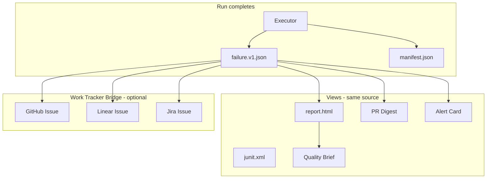

# GhostRun 2.0 — Product Vision

**Status:** Planning (post v1.2.0)  
**North star:** The first QA system that treats tests as **reviewable product memory** — not disposable scripts.

---

## Why 2.0 exists

v1.x made GhostRun credible: Author → Run → Repair → Improve, profiles, CI, monitoring, MCP, visual regression, security.

Most tools stop at **Run**. A few add **Author** (AI-generated tests). Almost none do **Repair + Improve** as first-class, git-native, human-reviewed workflows.

2.0 is not “more features.” It is a **category shift**:

> GhostRun becomes the **operating system for quality** in a repo — the layer between your app, CI, and AI agents that keeps tests honest, explainable, and alive.

---

## What no one else does (together)

| Capability | Playwright / Cypress | Checkly / Datadog Synthetics | Mabl / Testim | GhostRun 2.0 target |
|------------|---------------------|------------------------------|---------------|---------------------|
| Local-first, committed artifacts | ✓ (you write code) | ✗ hosted | △ hybrid | ✓ `.ghostrun/` in git |
| AI authoring | △ via IDE | ✗ | ✓ | ✓ |
| **Reviewable repair proposals** | ✗ | ✗ | △ opaque auto-heal | ✓ **core product** |
| **Improve loop from run history** | ✗ | △ dashboards | △ | ✓ **report-first → guided** |
| CI + monitor same assets | △ | ✓ | △ | ✓ |
| Agent-native (MCP) | ✗ | ✗ | ✗ | ✓ **QA Agent Protocol** |
| Intent + evidence, not just selectors | ✗ | ✗ | △ | ✓ **Flow Contract v2** |
| Coverage intelligence from runs | ✗ | △ | △ | ✓ **App Memory Graph** |
| **Failure → work tracker task** | ✗ | △ alerts only | ✗ | ✓ **Work Tracker Bridge** |
| **Unified evidence report** | △ trace | △ | △ | ✓ **canonical failure.v1** |

**The moat:** Transparent repair + durable memory + agent orchestration. Not “AI writes your tests.” **AI maintains your quality contract — under human review.**

---

## World-class at every step

GhostRun 2.0 is judged on **craft**, not feature count. Every touchpoint has the same standard:

| Step | User question | 2.0 answer |
|------|---------------|------------|
| **Init** | “Is this set up right?” | `ghostrun doctor` with clear pass/fail, fix commands, zero jargon walls |
| **Author** | “Did it capture what I meant?” | Preview graph + intent summary before save |
| **Run** | “What’s happening?” | Live step rail in terminal; failures show URL + selector + ms |
| **Fail** | “What broke and why?” | [Run Report](reporting-standards.md) — headline, screenshot, intent, history |
| **CI** | “Did the build break?” | Check Run + PR Digest + Evidence Bundle zip |
| **Track** | “Who fixes this?” | Optional Linear/GitHub/Jira issue with full context pre-filled |
| **Repair** | “What’s the fix?” | Proposal diff + rationale + apply/rerun commands |
| **Improve** | “What should we invest in?” | Quality Brief — clusters, flaky flows, blind spots |

**Design rule:** If two products have the same feature, GhostRun wins on **clarity and completeness of evidence**. No generic “Test failed” anywhere in the product.

See [reporting-standards.md](reporting-standards.md) for the canonical failure object and HTML/PR/alert specs.

---

## The 2.0 pillars (expanded)

### 1. Flow Contract v2 — Intent, not selectors

Today flows are graphs of actions with selectors. Selectors break. That's expected.

**2.0 change:** Every step stores:

```yaml
intent: "User submits checkout with valid card"
evidence:
  - role: button, name: "Pay now"
  - url_contains: /checkout/confirm
  - api: POST /api/orders → 201
assertions:
  - type: visible, target: "Order confirmed"
resolution:
  strategy: [semantic, structural, visual-anchor, css-fallback]
  lastKnownGood: ...
```

Execution tries resolution layers in order. When something breaks, the **repair proposal explains which layer failed and why** — not just “change `#btn-7` to `#btn-8`.”

**Why it's gold standard:** Tests survive refactors because they encode *meaning*. Repairs are auditable diffs on intent + resolution, not magic healing.

---

### 2. App Memory Graph — `.ghostrun/knowledge/`

GhostRun already scaffolds `knowledge/`. 2.0 makes it real.

From explore sessions, runs, and failures, build a **local graph**:

- Pages / routes discovered
- Critical paths (login → dashboard → billing)
- Flaky hotspots and repeat failure signatures
- Profile gaps (“staging auth expires every 4h”)
- **Coverage map:** which product areas have zero flow protection

`ghostrun improve` becomes predictive:

```bash
ghostrun improve --since 30d
# → "Checkout changed 12 times in git; 0 flows cover /checkout/*"
# → "3 flows fail only on production profile — auth drift suspected"
```

**Why it's gold standard:** QA tools report failures. GhostRun reports **where your product is blind.**

---

### 3. Repair-as-PR — CI failure → reviewable fix

When CI fails:

1. Run produces **Evidence Bundle** (screenshots, trace, DOM snapshot, network HAR slice, proposal JSON)
2. GhostRun generates a **repair branch** or PR comment with:
   - Human-readable failure summary (optional AI)
   - Proposed diff to flow files
   - “Accept repair” / “Dismiss” / “Re-run with baseline update” actions

```bash
ghostrun repair pr --run-id abc123   # opens PR with proposal + evidence
```

**Why it's gold standard:** No silent mutation. No “AI fixed it, trust me.” The fix enters the codebase like any other change.

---

### 4. QA Agent Protocol (QAP)

MCP today wraps CLI commands. 2.0 defines a **bounded agent loop**:

```
author → run → (fail?) → repair proposal → human gate → apply → rerun → improve
```

With hard limits from product-operating-model:

- Loop guards (`maxRepairAttemptsPerRun`, `maxSameFailureRepeats`)
- CI mode: propose only, never apply
- AI ledger on every step
- `ghostrun agent run --goal "verify staging smoke"` — orchestrated session with transcript

Cursor / Claude / custom agents become **clients** of GhostRun, not replacements for it.

**Why it's gold standard:** Agents without guardrails destroy trust. GhostRun is the **runtime + policy engine** for QA agents.

---

### 5. Evidence Bundle — the interchange format

Standard artifact per run:

```
.ghostrun/runs/<id>/
  manifest.json      # schema version, flow hash, profile, exit reason
  steps.jsonl          # machine-readable step log
  junit.xml
  report.html
  screenshots/
  trace.zip            # optional
  proposals/           # repair proposals spawned by this run
  summary.md           # optional AI, sanitized
```

Published to CI via `ghostrun report publish`. Consumed by GitHub Checks, IDE extension, MCP `get_run_evidence`.

**Why it's gold standard:** One contract for humans, CI, and agents. No vendor lock-in on “our dashboard only.”

---

### 7. Work Tracker Bridge — failures become tasks

Optional integrations for teams that want failures in their existing workflow tool — **never required**, always opt-in.

When a run fails (CI, monitor, or local with `--create-issue`):

1. GhostRun builds a **Work Item Payload** from the same `failure.v1.json` as the HTML report  
2. Creates or updates an issue in the configured tracker  
3. Stores the external URL back on the run (`integrations.githubIssue`, etc.)  
4. Reports and PR digests link to the issue — one click from CI to ticket

```bash
# Project config (.ghostrun/config.json)
{
  "integrations": {
    "github": {
      "enabled": true,
      "owner": "my-org",
      "repo": "my-app",
      "labels": ["ghostrun", "qa-failure"],
      "assignees": ["qa-oncall"],
      "createOn": ["ci-failure", "monitor-failure"]
    },
    "linear": {
      "enabled": true,
      "teamId": "QA",
      "projectId": "optional",
      "label": "ghostrun",
      "priority": 2,
      "createOn": ["ci-failure"]
    }
  }
}
```

```bash
ghostrun integrations list
ghostrun integrations test github
ghostrun run smoke --profile staging --ci --create-issue   # one-off override
```

#### Supported trackers (2.0 target)

| Tracker | Auth | Create issue | Link in report | Close on pass (optional) |
|---------|------|--------------|---------------|---------------------------|
| **GitHub Issues** | `GITHUB_TOKEN` | ✓ | ✓ | ✓ reopen if regresses |
| **Linear** | `LINEAR_API_KEY` | ✓ | ✓ | ✓ |
| **Jira** | API token + site | ✓ (phase 2.1) | ✓ | △ |
| **GitLab Issues** | project token | ✓ (phase 2.1) | ✓ | △ |

#### Issue body (world-class, not a dump)

Every created task includes:

- **Headline** — same as report hero (human-written template, optional AI polish)  
- **Failed step** — number, action, intent, selector, URL  
- **Screenshot** — attached or linked artifact URL (GHA artifact, not ephemeral localhost)  
- **Commands** — rerun, repair show/apply, link to HTML report in CI artifacts  
- **Metadata** — `runId`, `flowId`, `profile`, `ghostrun` version, workflow run link  
- **Dedup** — same `flowId + failedStep + profile + error signature` → comment on existing issue instead of spam  

#### CI setup (GitHub Actions example)

```yaml
env:
  GITHUB_TOKEN: ${{ secrets.GITHUB_TOKEN }}
  LINEAR_API_KEY: ${{ secrets.LINEAR_API_KEY }}
- run: ghostrun run smoke --profile staging --ci --reporter junit
  continue-on-error: true
- run: ghostrun report publish --create-issues
  if: failure()
```

`report publish --create-issues` reads `failure.v1.json` from the bundle and calls enabled integrations.

#### MCP tools (agents create tasks too)

- `create_failure_issue` — runId, tracker (`github` | `linear`)  
- `get_issue_for_run` — returns linked URLs  

Agents can file tasks; humans still own apply/repair in git.

**Why it's gold standard:** Other tools notify Slack and stop. GhostRun closes the loop: **failure → evidence → task → repair proposal → PR → pass → optional auto-close.** Your QA workflow lives where your team already works.

**What we won't do:** Become a project management product. No GhostRun-native issue board. Integrations only.

---

### 8. Reporting system — the product people open first

Reporting is not a side feature. For many users, **the HTML report is the product** they share in Slack.

2.0 moves report generation to `@ghostrun/reporting` with:

- Single **canonical failure object** → all views (HTML, PR, Slack, Linear, GitHub)  
- **Run Report v2** — timeline, intent block, repair panel, 30-run history sparkline  
- **Compare runs** — side-by-side screenshots for flake diagnosis  
- **Self-contained bundle** — open `report.html` from zip with no server  
- **Schema versioned** — `manifest.json` documents report format for CI consumers  

Full spec: [reporting-standards.md](reporting-standards.md).

**Why it's gold standard:** Playwright gives you a trace zip. Cypress gives you a video. GhostRun gives you a **complete failure story** — what, why, history, fix, and ticket link — in one place.

---

### 6. Portable execution — `@ghostrun/*` packages

The monolith (`ghostrun.ts`) ships v1. 2.0 **executes through packages**:

```
@ghostrun/core        — Flow Contract v2 types, validation
@ghostrun/executor    — deterministic runner (browser, API, load)
@ghostrun/repair      — proposal engine
@ghostrun/cli         — thin command surface
ghostrun-mcp          — QAP server
```

Teams can embed: `import { executeFlow } from '@ghostrun/executor'`.

**Why it's gold standard:** Gold-standard tools are **libraries first, CLI second**. Playwright proved this.

---

## What 2.0 is NOT

Stay disciplined. Do not become:

- A hosted SaaS monitoring company (Checkly already exists)
- An opaque auto-healing black box (Mabl's weakness is trust)
- A general-purpose RPA platform
- A replacement for Playwright (GhostRun **uses** Playwright; it owns the lifecycle)

Optional later: GhostRun Cloud for team sync, shared baselines, org dashboards — **never required** for core value.

---

## v1.3.0 — bridge release (4–6 weeks)

Ship cleanup and foundations. No big-bang rewrite.

| Theme | Deliverables |
|-------|----------------|
| **CLI finalization** | Remove legacy colon commands; 10-verb model only |
| **Package phase 1** | Executor path for `ghostrun run --ci`; 70% package coverage |
| **Loop guards** | Enforce `maxRepairAttemptsPerRun`, `maxSameFailureRepeats` in code |
| v1.3.0 bridge release | ✅ Shipped — Evidence Bundle, legacy removal, integrations scaffold |
| **Repair PR template** | `templates/ci/open-repair-pr.mjs` (GitHub Action step) |
| **Flow export v2 prep** | Add optional `intent` field on nodes; backward compatible |
| **IDE seed** | VS Code extension: flow tree, run status, open evidence |
| **Docs site** | `docs.ghostrun.dev` or GitHub Pages from `/docs` |

**Version story:** v1.3.0 = “trustworthy foundation.” v2.0.0 = “new contract + architecture.”

---

## 2.0 roadmap (phased)

### Phase A — Contract (2.0-alpha)

- Flow Contract v2 schema + migration tool (`ghostrun migrate flows`)
- Intent fields on author + explore output
- Layered selector resolution in executor
- Evidence Bundle as default run output
- **Run Report v2** HTML from `@ghostrun/reporting`
- **GitHub Issues** integration (`report publish --create-issues`)

### Phase B — Memory (2.0-beta)

- App Memory Graph builder from runs + explore
- `ghostrun improve --coverage`, `--risk` modes
- Knowledge queries via MCP (`query_app_memory`)
- **Linear** integration + issue dedup
- **PR Digest** + monitor **Alert Card** from `failure.v1.json`

### Phase C — Agent (2.0-rc)

- QA Agent Protocol spec + `ghostrun agent` command
- Bounded repair loop with transcript
- Repair-as-PR GitHub Action (first-class, not template-only)

### Phase D — Platform (2.0.0)

- `@ghostrun/executor` public API stable
- Monolith delegates to packages; CLI < 2000 lines
- VS Code extension GA (embedded Run Report webview)
- Author benchmark: 80%+ on standard SaaS fixture suite
- **Jira + GitLab** issue integrations
- Compare-runs report view + PDF export

---

## Success metrics for 2.0

| Metric | Target |
|--------|--------|
| Time to first CI smoke test | < 15 min from `npm i -g ghostrun-cli` |
| Repair proposal acceptance rate | > 60% (proposals are useful, not noise) |
| Flow survival without edit after UI refactor | > 70% with intent layers |
| Package test coverage | ≥ 70% |
| npm weekly downloads | 10× v1.2 baseline (growth, not vanity) |
| “Would you trust this in CI?” (design partner survey) | > 4/5 |
| Issue created from CI failure → time to first meaningful ticket body | < 5s automated |
| Report triage time (user study) | < 60s to understand failure without opening trace |

---

## The one-liner pitch

**GhostRun 2.0: Tests that explain themselves, fail with evidence, open a ticket where you work, fix through review, and learn what your app forgot to test.**

---

## Integration + report architecture (2.0)



---

## Next decision (for you)

Pick the **first 2.0 bet** to prototype:

1. **Flow Contract v2** — deepest technical moat, hardest migration  
2. **Repair-as-PR** — fastest wow in CI, visible differentiation  
3. **Run Report v2 + failure.v1** — daily delight; every user sees it  
4. **Work Tracker Bridge (GitHub first)** — immediate team workflow fit  
5. **App Memory Graph** — unique “improve” story, needs run volume  
6. **QA Agent Protocol** — rides the agent wave, needs guardrails first  

Recommendation: **v1.3.0 = Evidence Bundle + failure.v1 + report headline**, then **2.0-alpha in parallel: Run Report v2 + GitHub Issues integration + Repair-as-PR**.
